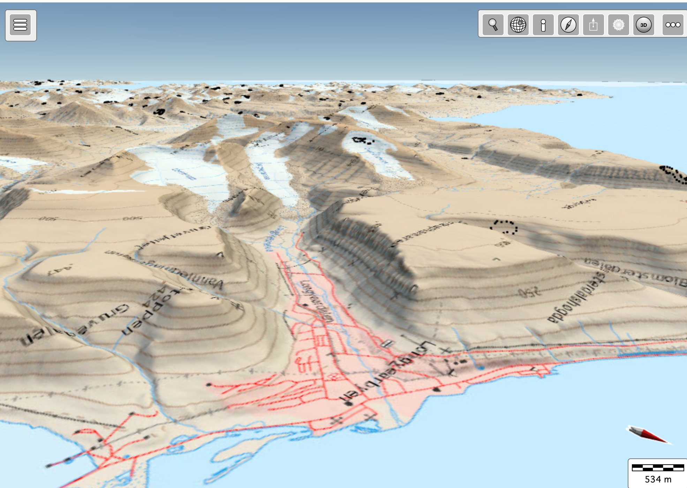
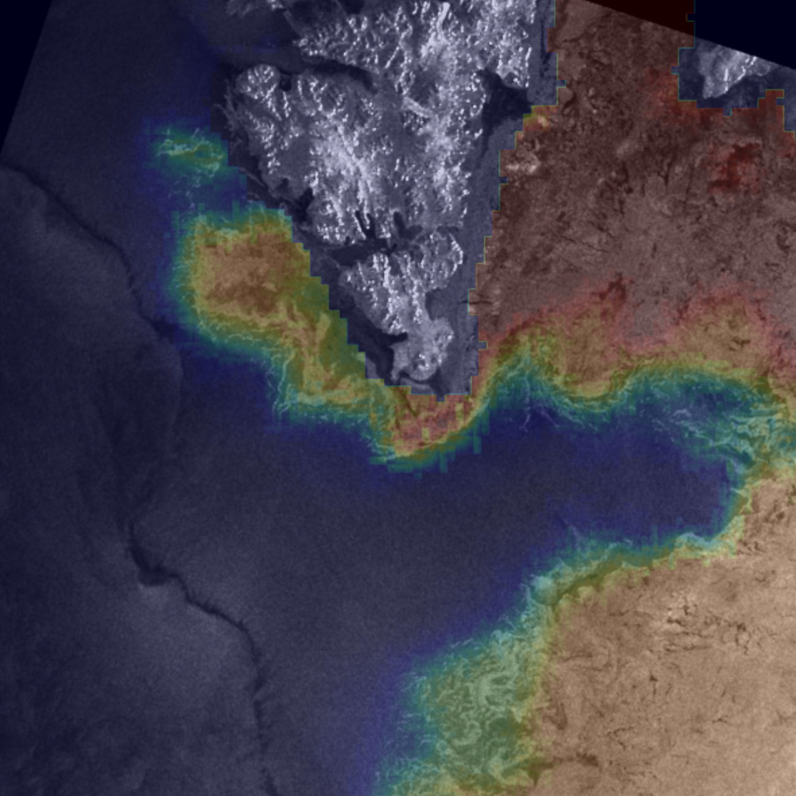

# Training material for the Cryosphere Virtual Laboratory

## Use case 1. How to use the 3D visualisation software

This use case shows how to search for data on the CVL Metadata Search engine, collocate in a Jupyter Notebook and visualise using the 3D-VIS software.

The datasets analysed in the use case are:

* SAR avalanche detections on Svalbard
* Svalbard digital elevation model

Watch the video: https://youtu.be/XXa39urDv_g
And open the notebook: https://github.com/CryosphereVirtualLab/cvl_tutorials/blob/main/sar_avalanches_3D_VIZ.ipynb

## Use case 2. Collocation of SAR data and sea ice charts

This use case shows how to search for raster data on the CVL Metadata Search engine, collocate and visualise in a Jupyter Notebook.

The datasets analysed in the use case are:

* SAR imagery from the Norwegian National Ground Segment
* Sea ice charts from the Norwegian Meteorological Institute

Open the notebook: https://github.com/CryosphereVirtualLab/cvl_tutorials/blob/main/collocate_SAR_and_ice_chart.ipynb